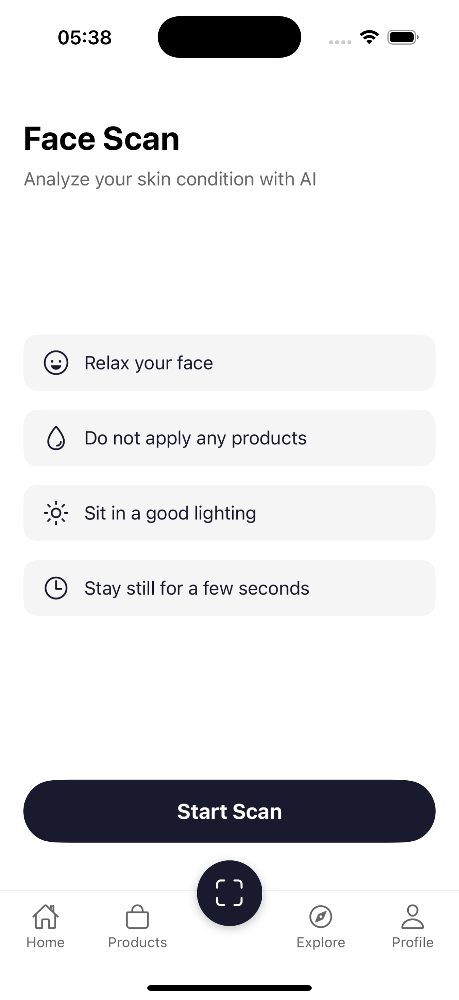
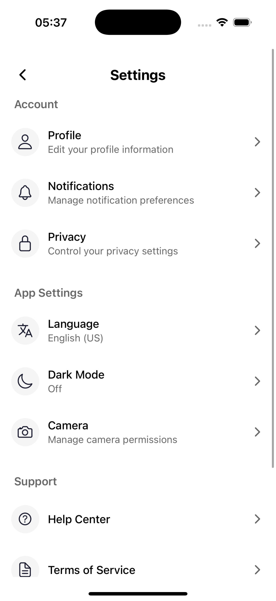
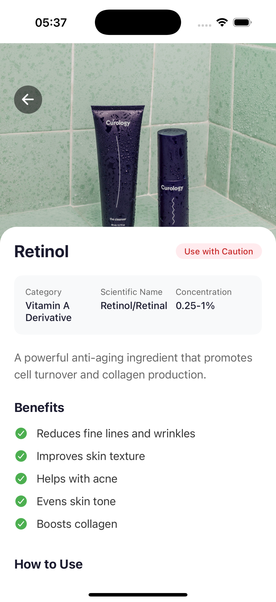
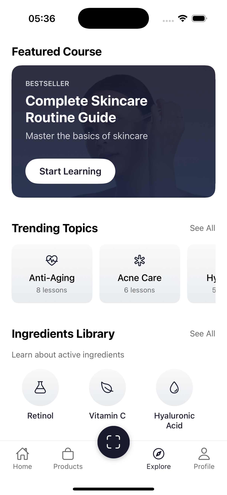
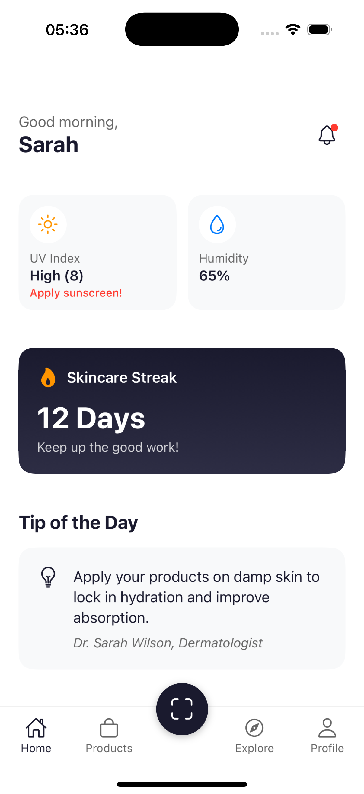
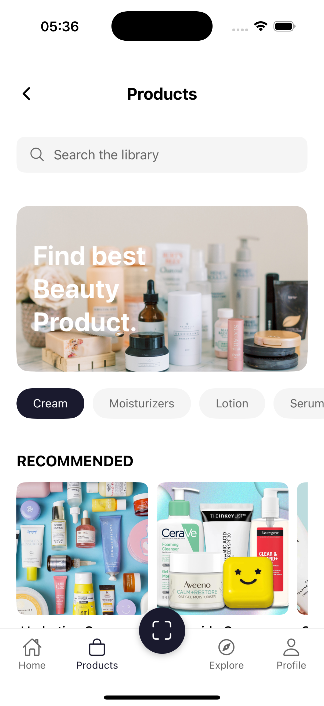
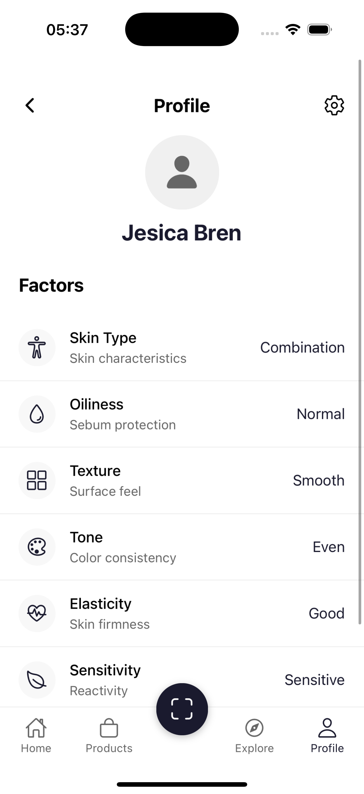
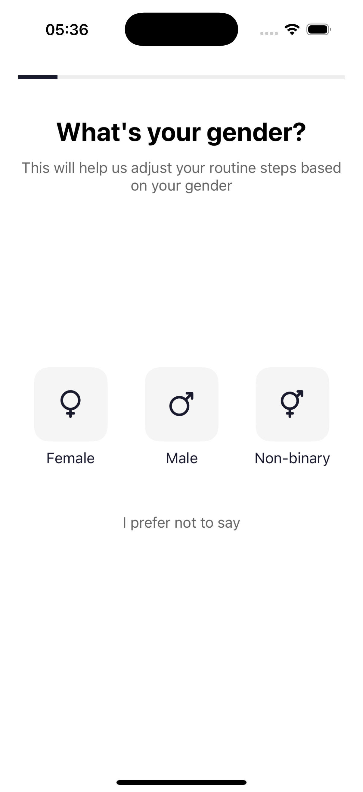
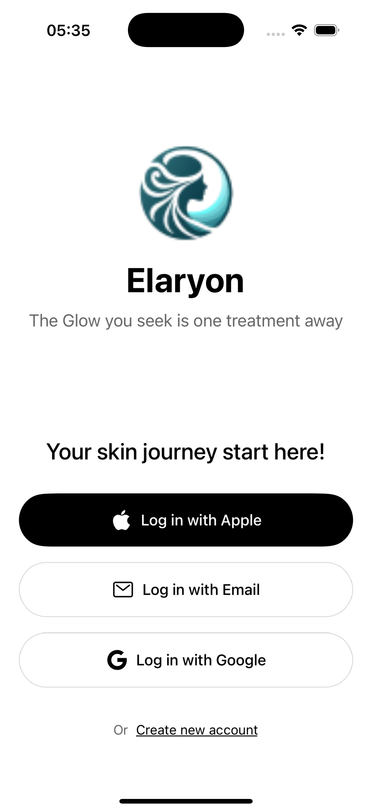

# Elaryion Mobile - AI-Powered Skincare App

A modern skincare app built with React Native and Expo, featuring AI-powered skin analysis, personalized routines, and product recommendations.

## Features

- 🤖 AI-Powered Skin Analysis (Connected to [Elaryion Skin Detection AI](https://github.com/Elaryion/skin-detection))
- 🎯 Personalized Skincare Routines
- 📊 Progress Tracking & Insights
- 📚 Skincare Academy & Education
- 🏪 Product Recommendations
- 📱 Modern & Intuitive UI

## 📱 Screenshots

<div style="display: flex; flex-wrap: wrap; gap: 10px;">
    
    
    
    
    
      
    
    
    
</div>

## ⚠️ Important Note

This is currently a UI prototype integrated with our [AI Skin Detection System](https://github.com/Elaryion/skin-detection). The skin analysis functionality is powered by our custom AI model, while other features like product recommendations and user profiles still use mock data for demonstration purposes.

## Tech Stack

- React Native
- Expo
- TypeScript
- Expo Router (File-based routing)
- Linear Gradient
- Expo Camera

## Getting Started

1. Clone the repository
```bash
git clone https://github.com/yourusername/elaryion-mobile.git
```

2. Install dependencies
```bash
npm install
```

3. Start the development server
```bash
npx expo start
```

## Project Structure

```
app/
├── (tabs)/               # Tab-based navigation screens
│   ├── home.tsx         # Home screen with personalized content
│   ├── products.tsx     # Product recommendations
│   ├── explore.tsx      # Skincare academy & education
│   ├── profile.tsx      # User profile & settings
│   └── face-scan.tsx    # AI skin analysis (mock)
├── onboarding/          # Onboarding questionnaire flow
├── data/                # Mock data files
└── utils/               # Utility functions & components
```

## Features To Be Implemented

- Backend Integration
- Real AI Skin Analysis
- User Authentication
- Data Persistence
- Real Product Database
- Push Notifications

## Contributing

Contributions are welcome! Please feel free to submit a Pull Request. For major changes, please open an issue first to discuss what you would like to change.

Please make sure to update tests as appropriate.

## License

This project is licensed under the GNU General Public License v3.0 - see the [LICENSE](LICENSE) file for details.

### What this means:

- ✅ You can freely use, modify, and distribute this software
- ✅ You can use this software for commercial purposes
- ✅ You must provide attribution to the original source
- ✅ You must disclose your source code when you distribute this software
- ✅ Any modifications must also be licensed under GPL-3.0
- ✅ You must state any changes made to the code
- ✅ You must include the original license and copyright notices

For more information about GPL-3.0, visit [GNU GPL v3.0](https://www.gnu.org/licenses/gpl-3.0.en.html)
